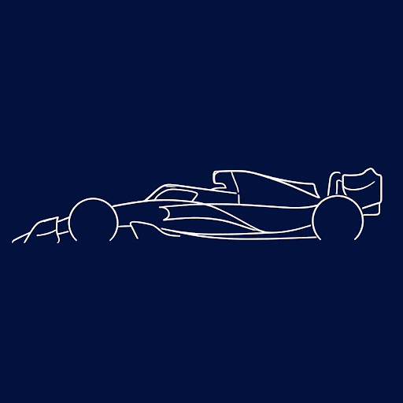

# 🏁 Never Lift

**2D Race Game Online — Built with AI Agents**

---

Jogo de corrida **2D multiplayer** (top-down, estilo drift) — construído quase inteiramente com agentes de IA (Codex), sobre um plano de arquitetura definido antes do código.

> Existe um protótipo anterior do mesmo autor, com o mesmo conceito de jogo. **Never Lift é um projeto novo, não uma versão dele** — o protótipo serve só como referência de sensação e comportamento esperado, nunca como código reaproveitado diretamente. A principal correção de arquitetura em relação ao protótipo: o servidor passa a ser a única autoridade sobre a corrida (física, colisão, progresso), em vez de cada cliente simular sozinho e só avisar os outros — que era a causa de um resultado diferente em cada tela.

---

## 🛠️ Tecnologias

### Backend

### Frontend

### DevOps & Ferramentas

---

## 📦 Repositórios

| Repositório | Descrição | Stack |
|---|---|---|
| [never-lift-backend](https://github.com/Never-Lift/never-lift-backend) | API REST + motor de corrida autoritativo | Java 21, Spring Boot 3.x, PostgreSQL |
| [never-lift-frontend](https://github.com/Never-Lift/never-lift-frontend) | Cliente web — conta, social, campeonato e o motor de corrida em Canvas | TypeScript, React, Vite, Tailwind, shadcn/ui |

---

## 📊 Estatísticas & Linguagens

<table>
  <tr>
    <td align="center">
      
    </td>
    <td align="center">
      
    </td>
  </tr>
  <tr>
    <td align="center">
      
    </td>
    <td align="center">
      
    </td>
  </tr>
</table>

---

## 📈 Histórico de Commits

---

## 🗺️ Acompanhamento do Progresso

| 📋 Project | 🎯 O que rastreia | 📊 Status |
|:---:|:---:|:---:|
| [Never Lift — Backend Roadmap](https://github.com/orgs/Never-Lift/projects) | Módulos 0–9 do backend |  |
| [Never Lift — Frontend Roadmap](https://github.com/orgs/Never-Lift/projects) | Módulos 0–9 do frontend |  |

> 💡 O status módulo a módulo está sempre atualizado nos **Projects** acima e no `AGENTS.md` de cada repositório.

---

## 🏗️ Arquitetura

| 🔌 Comunicação | ⚙️ Autoridade | 🌐 Cliente |
|:---:|:---:|:---:|
| REST + WebSocket | Servidor (física, colisão, progresso) | Predição local + Reconciliação + Interpolação |

- **REST** — conta, social, campeonato, recordes
- **WebSocket** — motor de corrida em tempo real *(um socket por sala)*
- O servidor roda a física em **passo fixo (tick)** e é a única autoridade — clientes enviam só intenção de input, nunca posição
- O cliente usa **predição local + reconciliação + interpolação** para esconder a latência sem abrir mão da autoridade do servidor

> 📂 Plano completo em `docs/` de cada repositório: `plano-implementacao-backend.md` e `plano-implementacao-frontend.md`

---

## 🔀 Fluxo de Desenvolvimento

| Branch | 🔒 Proteção | ➡️ Fluxo de entrada |
|:---:|:---:|:---:|
| `main` |  | Somente merge vindo de `develop` |
| `develop` |  | Branches `feature/*` e `fix/*` |
| `feature/*` `fix/*` |  | Merge em `develop` via Pull Request |

> ✅ Nenhum módulo é considerado pronto sem **testes automatizados** cobrindo suas regras de negócio — regra fixada no `AGENTS.md` de ambos os repositórios.

---

## 👥 Colaboradores

---

